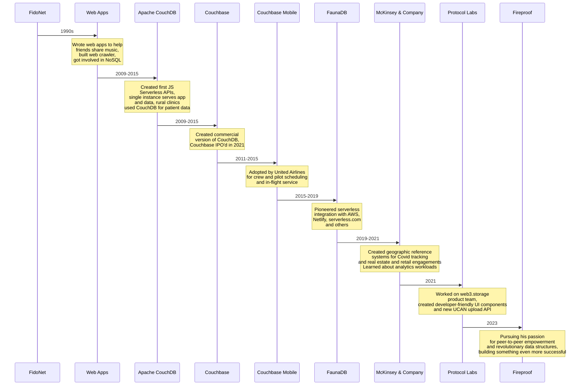

Chris is an experienced entrepreneur and technologist with a passion for empowering users through revolutionary data structures. With a philosophy focused on decentralization and peer-to-peer computing, he has a track record of rewriting the database industry.

